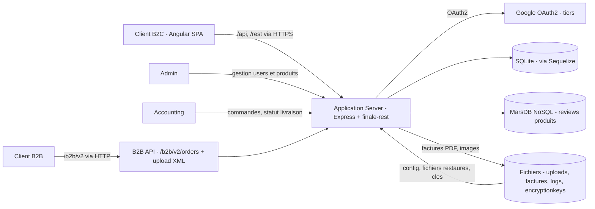

# Threat model - fork Juice Shop

> Complète `docs/security/contexte.md` (S1). Les biens essentiels et les événements redoutés
> repris ici en section 1 y sont définis et justifiés.

## 1. Contexte et biens essentiels

| Bien essentiel | Pourquoi il compte | Événement redouté (EBIOS) | Gravité (1 à 4) |
| --- | --- | --- | --- |
| BE1 - comptes clients et données personnelles | identité, e-mail, adresses et mots de passe ; incident RGPD à notifier | ER1 - divulgation de la base des comptes clients, préjudice RGPD et perte de confiance | 4 |
| BE2 - commandes et historique d'achat | preuve de la transaction pour le client et le commerçant | ER2 - accès en lecture et écriture aux paniers et commandes d'autres clients | 3 |
| BE3 - moyens de paiement enregistrés | fraude financière directe subie par le client | ER1 (par extension : la compromission de la base porte aussi les cartes) | 4 |
| BE4 - disponibilité et intégrité de la boutique | canal de vente unique du commerçant | ER3 - indisponibilité 24 h en période de soldes, perte de chiffre d'affaires | 3 |

## 2. Data flow diagram

Trust boundaries identifiées :

1. **Navigateur / serveur applicatif** - réseau public. Tout ce qui vient du client est hostile,
   y compris les identifiants de ressource (`:id`), les en-têtes et le corps de requête.
2. **Serveur applicatif / zone de stockage** - SQLite via Sequelize, MarsDB, système de fichiers.
   Une requête mal construite franchit cette frontière avec les privilèges de l'application.
3. **Zone publique / back-office** - même process Express, rôles distincts (`isAuthorized`,
   `isAccounting`, `denyAll`). La frontière est purement logicielle : il n'y a pas d'isolation
   réseau entre la boutique et l'administration.
4. **Serveur applicatif / tiers Google OAuth2** - hors périmètre de correction, mais dans la
   surface d'attaque : la confiance accordée au jeton renvoyé par le tiers est un point d'entrée.
5. **Système de fichiers / serveur applicatif** - le flux retour (`FS --> API`) est une frontière
   à part entière : `encryptionkeys/` et `logs/` sont servis en navigation de répertoire.

## 3. Analyse STRIDE

| # | Élément / flux | Catégorie STRIDE | Menace concrète | Exigence de sécurité | Priorité |
| --- | --- | --- | --- | --- | --- |
| 1 | `/rest/basket/:id`, flux client vers API | Tampering | `retrieveBasket` charge le panier par l'`id` de l'URL (`routes/basket.ts:19`, `findOne({ where: { id } })`) sans aucun filtre d'appartenance : incrémenter l'identifiant donne le panier d'un autre client | le filtre d'appartenance doit être **dans la requête qui charge l'objet** (`where: { id, UserId: req.user.id }`), pas dans un middleware ni côté client | H |
| 2 | Jeton JWT, authentification | Spoofing | la clé privée RSA est en dur dans le source (`lib/insecurity.ts:21`) et la clé publique est servie par navigation de répertoire sur `/encryptionkeys` (`server.ts:277`) : n'importe qui peut forger un jeton `RS256` valide, rôle admin compris | la clé de signature vit hors du dépôt, est rotationnable sans redéploiement, et `encryptionkeys/` n'est pas exposé en HTTP | H |
| 3 | Cookies de session | Spoofing | le secret de `cookie-parser` est la chaîne en dur `'kekse'` (`server.ts:289`) : un cookie signé est falsifiable par quiconque lit le source public | secret de signature injecté par configuration, jamais littéral dans le code | M |
| 4 | Store SQLite, table `Users` | Information disclosure | les mots de passe sont hachés en MD5 sans sel (`lib/insecurity.ts:41`, `crypto.createHash('md5')`) : une base exfiltrée se casse en masse hors ligne | dérivation de clé lente et salée (argon2id ou bcrypt) ; MD5 interdit sur toute donnée d'authentification | H |
| 5 | Flux API vers MarsDB, avis produits | Tampering | `db.reviewsCollection.find({ $where: 'this.product == ' + productId })` (`routes/chat.ts:149`) concatène une entrée utilisateur dans une expression `$where` évaluée côté base : injection NoSQL avec exécution de code | pas de concaténation dans une clause de requête ; `$where` proscrit, filtre structuré et typé | H |
| 6 | Réponses HTTP, en-têtes | Information disclosure | `app.use(cors())` autorise toutes les origines (`server.ts:183`), `helmet` n'est branché que sur `noSniff` et `frameguard` (`server.ts:186-187`), `xssFilter` est commenté et il n'y a pas de CSP | CORS restreint à une liste d'origines explicite ; CSP, HSTS et `Referrer-Policy` servis par Express | M |
| 7 | Navigation `/ftp`, `/encryptionkeys`, `/support/logs` | Information disclosure | `serve-index` expose le contenu de ces répertoires (`server.ts:269`, `277`, `281`) : factures d'autres clients, journaux applicatifs et matériel cryptographique sont listables et téléchargeables sans authentification | aucun répertoire du serveur n'est exposé en listing ; les fichiers clients sont servis par une route qui vérifie l'appartenance | H |
| 8 | Endpoint `/metrics` | Information disclosure | les métriques Prometheus sont servies avant le catch-all Angular (`server.ts:675`) et renseignent un attaquant sur le trafic, les routes et le volume de comptes | `/metrics` restreint au réseau de supervision, ou authentifié | L |
| 9 | Journaux applicatifs | Repudiation | les journaux sont en clair dans `logs/` et il n'existe aucune piste d'audit des actions d'administration : une création de compte admin ou une modification de commande ne laisse pas de trace attribuable | journal d'audit distinct, en append-only, horodaté et attribué à un identifiant d'acteur pour toute action privilégiée | M |
| 10 | `/rest/user/reset-password` | Denial of service | le compteur de limitation est indexé sur `headers['X-Forwarded-For']` (`server.ts:346`), en-tête entièrement contrôlé par le client : il suffit de le faire varier pour contourner la limite | la clé de limitation dérive de l'IP de connexion réelle, ou d'un `X-Forwarded-For` validé contre une liste de proxys de confiance | M |
| 11 | Upload XML B2B, `/file-upload` | Denial of service | `parseXmlString` traite le document sans borne sur l'expansion d'entités (`routes/fileUpload.ts:77`) : un document à entités imbriquées consomme CPU et mémoire jusqu'à l'épuisement, et le code prévoit déjà le cas « Script execution timed out » | parseur XML configuré sans résolution d'entités externes, avec bornes de taille, de profondeur et de temps | M |
| 12 | `POST /api/Users` | Elevation of privilege | la route ne valide que la présence d'`email` et `password` (`server.ts:408`) avant de laisser `finale-rest` écrire l'enregistrement : le champ `role` envoyé dans le corps est persisté tel quel, un inscrit s'octroie `admin` | liste blanche des champs acceptés en écriture ; `role` non assignable par l'appelant, fixé côté serveur | H |
| 13 | Middleware d'autorisation | Elevation of privilege | `isAuthorized()` se réduit à `expressJwt({ secret: publicKey })` (`lib/insecurity.ts:52`) : il vérifie que le jeton est signé, jamais que le porteur a le droit sur la ressource ou le rôle demandé | l'autorisation vérifie le rôle **et** l'appartenance de la ressource, séparément de l'authentification | H |

Couverture : Spoofing (2, 3), Tampering (1, 5), Repudiation (9), Information disclosure (4, 6, 7, 8),
Denial of service (10, 11), Elevation of privilege (12, 13).

## 4. Correspondance avec EBIOS RM

| Menace STRIDE | Événement redouté associé | Scénario de risque (source -> chemin -> impact) |
| --- | --- | --- |
| #1 Tampering sur `/rest/basket/:id` | ER2 - accès aux paniers et commandes d'autres clients | client malveillant authentifié -> il incrémente l'`id` de panier dans l'URL -> lecture et modification du panier d'un autre client -> divulgation d'historique d'achat et altération de la preuve de transaction (BE2) |
| #2 Spoofing du jeton JWT | ER1 - divulgation de la base des comptes clients | cybercriminel externe -> il lit la clé privée dans le source public, ou la clé publique via `/encryptionkeys` -> il forge un jeton de rôle admin -> accès à l'intégralité des comptes et des cartes (BE1, BE3) |
| #4 Information disclosure sur SQLite (MD5) | ER1 - divulgation de la base des comptes clients | cybercriminel externe -> extraction de la table `Users` par l'un des chemins ci-dessus -> cassage hors ligne des empreintes MD5 non salées -> réutilisation des mots de passe sur d'autres services, préjudice RGPD et notification CNIL (BE1) |
| #5 Tampering par injection NoSQL sur les avis | ER1 et ER3 | attaquant externe non authentifié -> il place une expression dans le paramètre de recherche d'avis évalué par `$where` -> exécution de code dans le moteur de requête -> extraction de données ou déni de service du service d'avis (BE1, BE4) |
| #7 Information disclosure par navigation de répertoire | ER1 - divulgation de la base des comptes clients | attaquant externe non authentifié -> il navigue sur `/encryptionkeys` et `/ftp` -> récupération du matériel cryptographique et des factures nominatives d'autres clients -> chaîne directement sur le scénario #2 (BE1, BE2) |
| #12 Elevation of privilege à l'inscription | ER1 - divulgation de la base des comptes clients | attaquant externe -> il s'inscrit en ajoutant `role: admin` au corps de la requête -> il dispose du back-office -> lecture et export de la base clients (BE1) |
| #13 Elevation of privilege sur l'autorisation | ER2 puis ER1 | client authentifié -> il appelle une route d'administration avec son jeton valide -> le middleware ne contrôle que la signature -> accès aux fonctions privilégiées depuis un compte ordinaire (BE1, BE2) |

## 5. Suivi

Rattachement de chaque exigence de priorité H à sa vérification future :

| Ligne | Exigence H | Où elle sera vérifiée |
| --- | --- | --- |
| #1 | filtre d'appartenance dans la requête | **S5** - correctif de conception n°1, mesuré `200` puis `403` sur un panier tiers |
| #2 | secret hors du dépôt, `encryptionkeys/` non exposé | **S3** - règle Semgrep `juiceshop-hardcoded-private-key` + gitleaks `private-key` sur `lib/insecurity.ts:21` |
| #4 | pas de MD5 sur un mot de passe | **S3** - règle Semgrep ciblée `juiceshop-weak-hash-md5` (le ruleset `p/ci` ne couvre pas MD5 en JavaScript) |
| #5 | pas de concaténation dans une clause de requête | **S3** - `p/ci` remonte `code-string-concat` ; à confirmer sur `routes/chat.ts` qui est hors du périmètre `lib routes models` scanné |
| #7 | aucun listing de répertoire | **S5** - ZAP baseline en DAST ; sinon **S8** - revue manuelle, aucun outil statique ne voit une route `serve-index` |
| #12 | liste blanche des champs en écriture | **S8** - finding de revue guidée ; aucune règle SAST générique ne détecte l'assignation de masse via `finale-rest` |
| #13 | autorisation distincte de l'authentification | **S5** - correctif de conception n°1 (même cause que #1) ; **S8** pour la généralisation aux autres routes |

Les lignes M et L (#3, #6, #8, #9, #10, #11) sont portées au rapport d'audit de **S8** et arbitrées
dans le plan de remédiation de **S9**. La ligne #6 est traitée en partie dès **S5** par le correctif
de conception n°2 (CSP, HSTS, `Referrer-Policy`, CORS restreint).
